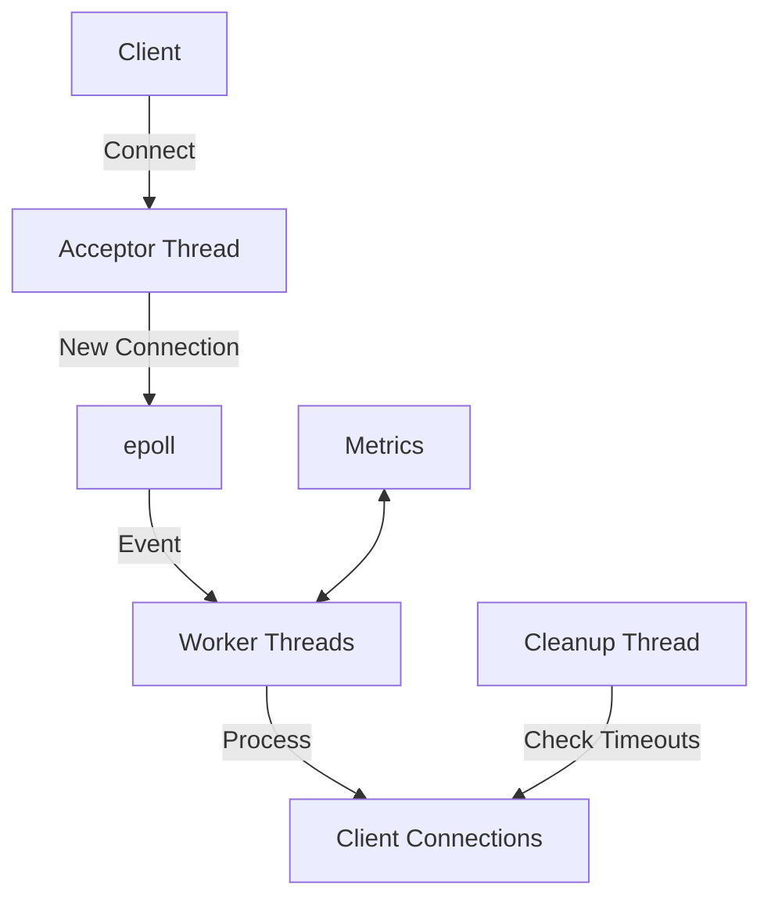

# Optimized Heartbeat Server

## Overview
The Optimized Heartbeat Server is a high-performance, multi-threaded server designed to handle thousands of concurrent client connections with minimal latency. It uses Linux's epoll for efficient I/O multiplexing and implements a worker thread pool for parallel request processing.

## Features

- **High Performance**: Handles thousands of concurrent connections with low latency
- **Scalable**: Multi-threaded architecture with configurable worker threads
- **Efficient**: Uses epoll for I/O multiplexing and edge-triggered events
- **Robust**: Implements proper connection handling and cleanup
- **Monitorable**: Provides comprehensive metrics for monitoring

## Architecture



## Configuration

The server can be configured using the following parameters:

| Parameter | Default | Description |
|-----------|---------|-------------|
| Port | 9002 | TCP port to listen on |
| Worker Threads | CPU cores | Number of worker threads |
| Client Timeout | 60s | Inactive client timeout |
| Cleanup Interval | 30s | Interval for cleaning up dead connections |

## Metrics

The server provides the following metrics:

| Metric | Type | Description |
|--------|------|-------------|
| total_received_messages | Counter | Total number of messages received |
| total_clients_connected | Counter | Total number of clients connected |
| total_bytes_received | Counter | Total bytes received |
| total_processing_time_ns | Counter | Total processing time in nanoseconds |
| active_connections | Gauge | Current number of active connections |
| messages_per_second | Gauge | Current message processing rate |

## Monitoring Setup

### Prerequisites

- Prometheus
- Grafana
- Node Exporter (for system metrics)

### Prometheus Configuration

Add the following to your `prometheus.yml`:

```yaml
scrape_configs:
  - job_name: 'heartbeat_server'
    static_configs:
      - targets: ['localhost:9091']  # Default metrics port

  - job_name: 'node'
    static_configs:
      - targets: ['localhost:9100']  # Node Exporter
```

### Grafana Dashboard

1. Import the dashboard from `grafana/dashboard.json`
2. Configure the Prometheus data source
3. The dashboard will show:
   - Connection statistics
   - Message rates
   - System resource usage
   - Error rates

## API Reference

### Starting the Server

```cpp
OptimizedHeartbeatServer server(port, worker_threads);
server.start();
```

### Stopping the Server

```cpp
server.stop();
```

### Getting Metrics

```cpp
auto metrics = server.get_metrics();
std::cout << "Messages received: " << metrics.total_received_messages << "\n";
```

## Performance Tuning

### Thread Pool Sizing

```cpp
// Optimal worker threads = CPU cores - 2 (for acceptor and cleanup)
size_t worker_threads = std::thread::hardware_concurrency() - 2;
OptimizedHeartbeatServer server(port, worker_threads);
```

### Socket Buffer Sizes

```cpp
// In create_listening_socket()
int buf_size = 1024 * 1024;  // 1MB
setsockopt(fd, SOL_SOCKET, SO_RCVBUF, &buf_size, sizeof(buf_size));
setsockopt(fd, SOL_SOCKET, SO_SNDBUF, &buf_size, sizeof(buf_size));
```

## Troubleshooting

### Common Issues

1. **Connection Drops**
   - Check system limits (`ulimit -n`)
   - Verify network connectivity
   - Monitor system resources

2. **High Latency**
   - Check CPU usage
   - Monitor network latency
   - Review worker thread count

3. **Memory Leaks**
   - Check for proper connection cleanup
   - Monitor memory usage over time
   - Enable debug logging

## Logging

Set the log level using environment variables:

```bash
export HEARTBEAT_LOG_LEVEL=debug  # debug, info, warning, error
```

## Security Considerations

- Always use TLS for production traffic
- Implement authentication
- Rate limit connections
- Keep the server updated
